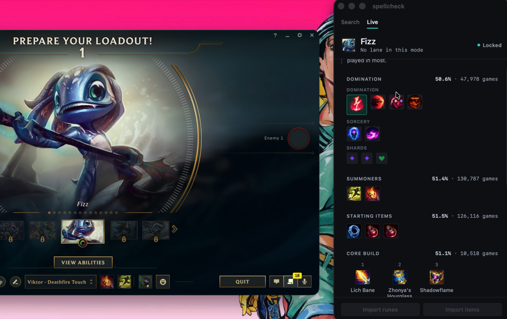
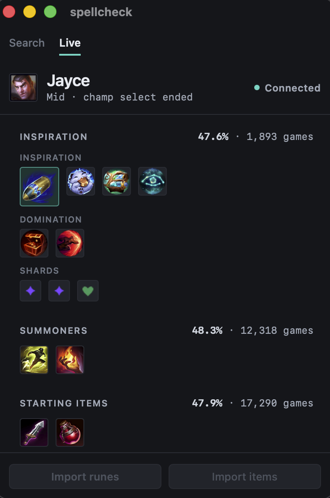

# spellcheck

A macOS and Windows app that detects the champion and role you lock into
during League champion select, then shows the optimal build path — items,
runes, summoners, skill order — for that pair.

## Latest release — 0.1.3

Download: **[macOS (universal)](https://pub-7d8d63aa0eec43f5a16598403866eed1.r2.dev/spellcheck_0.1.3_universal.dmg)**
· **[Windows (x64)](https://pub-7d8d63aa0eec43f5a16598403866eed1.r2.dev/spellcheck_0.1.3_x64-setup.exe)**

Windows installs its own updates now; macOS will not until the app is code
signed. Every GitHub release also carries its own changelog entry, generated
from `CHANGELOG.md` at build time.

The Windows install button will not work until 0.1.4 — an installed copy uses
whatever updater it was built with, so 0.1.3 has to be installed by hand once
more.

Full history in **[CHANGELOG.md](CHANGELOG.md)**.

## Installing a beta build

The betas are unsigned, so both systems try to stop you. macOS does it once per
install; Windows does it on every update, because the updater re-runs the
installer. Neither is a sign of a bad download.

**macOS**

1. Open the `.dmg` and drag spellcheck out of it.
2. Launch it and let it get blocked — that refused launch is what puts the app
   in the queue for step 3.
3. System Settings → Privacy & Security, scroll down to Security, then
   **Open Anyway**. Authenticate.
4. Launch again. It opens, and keeps opening from then on.

Right-clicking and choosing **Open** was the old shortcut for this and no
longer works on current macOS. **Keep betas out of `/Applications`** — an
unsigned bundle cannot replace itself there, so the updater leaves the new copy
beside the old one under a collision name and deletes the original. Use
`~/Applications` until the app is signed.

**Windows**

1. Run the `-setup.exe`. SmartScreen shows "Windows protected your PC" with
   only a **Don't run** button.
2. Click **More info**, then **Run anyway**.

**Why none of it is signed: I'm broke.** Neither warning means the download was
tampered with — what is missing is a paid attestation of who built the binary.
Apple charges $99/yr for that, a Windows certificate authority $200–600/yr (or
about $10/month through Azure Trusted Signing, if you qualify). That is not a
bill worth paying for a beta with a handful of testers.

It is not permanent. The release workflow already reads the `APPLE_*` secrets,
so macOS signing turns on the day there is a certificate to hand it; Windows
needs a step written first. Apple is worth doing first, because signing there
is also what makes the macOS updater safe.

If League is installed somewhere other than the default location — most likely
on Windows, where the installer lets you pick a drive — point the app at the
lockfile yourself:

```sh
SPELLCHECK_LOCKFILE='D:\Games\League of Legends\lockfile'
```

## Start here

- **[docs/blueprint.html](docs/blueprint.html)** — the architecture. How the
  pieces connect, what is built and what is not, where to start editing.
- **[docs/roadmap.html](docs/roadmap.html)** — what is left to do. A dated
  snapshot rather than a standing description, so check its claims before
  building on them.
- **[CLAUDE.md](CLAUDE.md)** — the constraints themselves. This is the
  authority; the blueprint explains these rules but never overrides them.

## Build

```sh
npm install
npm run dev          # run it
npm run app          # bundle a .app into src-tauri/target/release/bundle/macos/
npm run fake-client  # a stand-in League client, to develop without a game
cd src-tauri && cargo test
```

Rust must be on your `PATH` (`. "$HOME/.cargo/env"`).

`npm run app` builds for the machine you are on: a `.dmg` on macOS, an NSIS
`.exe` on Windows. There is no cross-compile — `ring` builds C, so the Windows
installer can only be produced on Windows. That is what the Windows runner in
`.github/workflows/release.yml` is for.

The crawler that fills `data/builds/` runs in CI, not in the app, and is
dependency-free — its tests need nothing installed:

```sh
npm run test:ingest
RIOT_API_KEY=RGAPI-... node scripts/ingest/index.mjs   # a real crawl
```

## Releases

[CHANGELOG.md](CHANGELOG.md) records every released version. A tag is the only
thing that ships a build, so the changelog entry and the version bump belong in
the same run-up to a tag as the tag itself.

Two other places repeat that entry and go stale silently: the **Latest
release** section above, and the GitHub release description. Update the first
by hand, the second with `gh release edit vX.Y.Z --notes-file <file>`.

Tagging `v*` builds both platforms and publishes a GitHub prerelease. The tag
must match the version in `package.json`, `src-tauri/tauri.conf.json` and
`src-tauri/Cargo.toml` — nothing checks this automatically. Run the workflow
manually (`workflow_dispatch`) to prove a change builds on Windows without
publishing anything.

## Updates

An installed copy checks for a new version once at launch and, if there is one,
offers a bar with a button. Nothing is ever installed without that press — the
same rule `CLAUDE.md` sets for item set and rune imports, for the same reason.

**On Windows** the press downloads, installs and restarts into the new version.
**On macOS** it opens the installer in a browser and you install it by hand,
because an unsigned bundle cannot replace itself inside `/Applications` — see
[Installing a beta build](#installing-a-beta-build).

The installers and the update manifest live in a Cloudflare R2 bucket rather
than on the GitHub release. The bucket dates from when this repository was
private — GitHub does not serve a private repo's release assets to anonymous
clients, which an installed app is — and it stays now that the repository is
public because every installed copy is compiled to look there and nowhere
else (see `R2_PUBLIC_URL` below). Anyone can download from it, no GitHub
account needed; the GitHub release is only the record of what was built.

Two signatures are involved and they are not substitutes for each other:

- **The updater signature** is a minisign keypair. The plugin verifies every
  download against the public key baked into `src-tauri/tauri.conf.json`, the
  check cannot be disabled, and it is the only reason serving these files from
  a public bucket is safe. Generate one with
  `npx tauri signer generate -w ~/.tauri/spellcheck.key`. **Lose the private
  key and no installed copy can ever be updated again** — there is no recovery,
  only a new key and a new manual install for everybody.
- **OS code signing** is separate, still absent, and is what Gatekeeper and
  SmartScreen care about.

The release workflow needs these set:

| Name | Kind | What it is |
| --- | --- | --- |
| `TAURI_SIGNING_PRIVATE_KEY` | secret | contents of `~/.tauri/spellcheck.key` |
| `TAURI_SIGNING_PRIVATE_KEY_PASSWORD` | secret | empty unless you set one |
| `R2_ACCOUNT_ID` | secret | Cloudflare account id |
| `R2_ACCESS_KEY_ID` | secret | R2 API token |
| `R2_SECRET_ACCESS_KEY` | secret | R2 API token |
| `R2_BUCKET` | secret | bucket name |
| `R2_PUBLIC_URL` | variable | public base URL, no trailing slash |

`R2_PUBLIC_URL` is a repository *variable* rather than a secret because it is
public by definition — it is compiled into every binary. It must match the
`endpoints` entry in `src-tauri/tauri.conf.json`, and **that URL cannot be
changed for copies already installed**: a shipped binary only ever looks where
it was built to look, so changing it strands every existing install.

## About

I'm a hardstuck gold mid. I built this for myself, and I'm not qualified to
tell anyone what to build — so the app doesn't. It shows you what the data
says, and when it's reasoning rather than measuring, it tells you that too.



The client on the left, spellcheck on the right. Lock a champion and the build
fills in on its own — runes, summoners, starting items, core build.



Champion **and** role come from champ select; this one read Jayce mid. Every
percentage carries the sample it was measured over, because a win rate over
1,893 games and one over 12 are not the same claim.

It's a side project and it's early. If it gets something wrong in your game,
that's the thing I want to hear about.

Whatever else changes, a few decisions are not up for negotiation, because
they are the reasons this exists rather than preferences about how to build it:

- **It stays small.** Rust and Tauri, a hard budget of under 120MB resident,
  a frontend of vanilla TypeScript and plain CSS. Nothing that runs beside a
  game should cost more than the game does.
- **It never scrapes.** Documented APIs only — Riot's own, Data Dragon, and
  OP.GG's published endpoint.
- **It never acts on its own.** Item set and rune page imports happen on a
  button press or not at all. An app that rewrites your runes mid-champ-select
  has taken the decision away from you.
- **A statistic and a rule never look alike.** A win rate is a measurement; a
  reason to build antiheal is an argument. The interface will not let the
  second borrow the authority of the first.

Bug reports and feedback are welcome in
[issues](https://github.com/bryanbrian1/spellcheck/issues) — what broke is more
useful than what worked.

## Licence

MIT. See [LICENSE](LICENSE).

The build data is not ours to relicense and is not covered by it. Riot-sourced
data — Data Dragon and our own crawl under `data/` — is redistributable and
ships with the app. OP.GG data is fetched per request, never cached into this
repository and never redistributed, which is why `OpggProvider` holds nothing
between calls.

spellcheck isn't endorsed by Riot Games and doesn't reflect the views or
opinions of Riot Games or anyone officially involved in producing or managing
Riot Games properties. Riot Games and all associated properties are trademarks
or registered trademarks of Riot Games, Inc.
